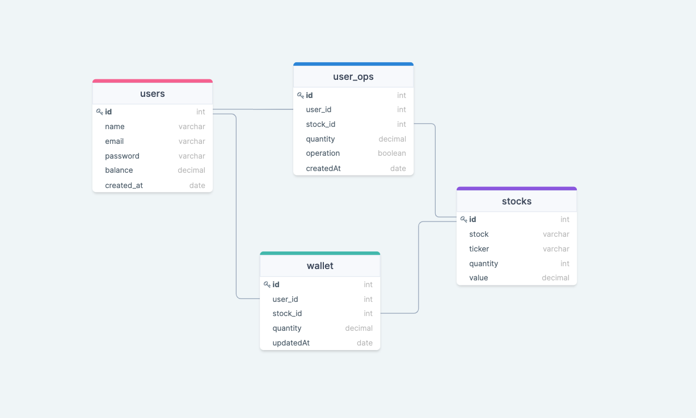

# Desafio XP


### Tecnologias utilizadas

* JavaScript
* node.js
* mocha
* chai
* sinon
* docker
* git
* MySql
* JWT
* Express
* Swagger
* API Rest


## Descrição

Esta API tem como objetivo simular transações de compra e venda de ações, suas funcionalidades incluem:

- Cadastra novo usuário
- Realizar consulta de compra e venda de uma ou todas as operações do usuário
- Compra uma ação disponível
- Vende uma ação que você possui
- Realiza depositos na conta do usuário
- Realiza saques na conta do usuário
- Realiza consulta de todas as ações
- Realiza consulta de uma ação específica
- Realiza consulta de ações que o usuário possui

*Acesse a documentação da [API Swagger aqui](https://passaportexp.herokuapp.com/docs/)

(use este exemplo para realizar o login e autenticar com o token JWT)
```
{
  "email": "gabresendemkt@gmail.com",
  "password": "passaportexp"
}
```


### Estrutura do BD




## Tomada de decisões

- Neste projeto eu escolhi desenvolver a aplicação na linguagem JavaScript pois possuo mais segurança e conhecimento nesse momento.
- Fiz a utilização do Node.js para realizar as requisições da API Rest.
- Na confecção dos testes unitários utilizei Mocha, Chai e Sinnon que na minha opinião desempenham muito bem e cumprem o papel que foram escalados a fazer.
- utilizei a dockerização por containers para facilitar o deploy e a instalação do projeto em outras máquinas e sistemas.
- Na estrutura da API Rest optei pela utilização da arquitetura MSC.
- Neste projeto eu não optei pela utilização de ORM's, a camada de models realiza a conexão com o banco e executa todas as querys utilizando SQL (mas pretendo realizar melhorias futuras neste projeto e então implementarei uma ORM para facilitar a manutenciabilidade do código).
- Para validação e autenticação das requisições eu utilizei a criptografia JWT.
- Para criação das rotas eu utilizei o framework Express e para recuperar erros no middleware de erros fiz a utilização da biblioteca do Express-async-errors
- Para documentar o funcionamento da API eu fiz a utilização do SWAGGER, que facilita a utilização e reaproveitamento das rotas no Front End.
- Realizei a configuração do CI para controle de lint do pull e push request no repositório.


### Ajustes e melhorias

O projeto ainda está em desenvolvimento e as próximas atualizações serão voltadas nas seguintes tarefas:

- [x] Criar DER
- [x] Dockerizar a aplicação
- [x] Criar os endpoints
- [x] Aplicar regras de negócio
- [x] Implementar middlewares de validações
- [x] Criar autenticação e autorização JWT
- [x] Alimentar o banco de dados com dados de investimento
- [x] Implementar API SWAGGER
- [x] Testar a aplicação*
- [x] Realizar o deploy da aplicação
- [ ] Implementar ORM
- [ ] Implementar transactions nas operações


## 💻 Pré-requisitos

Antes de começar, verifique se você atendeu aos seguintes requisitos:
* Esta aplicação conta com a dockerização do Node e do Banco MYSQL
* Você instalou a versão mais recente do `Docker e Docker compose`

## 🚀 Instalando Desafio XP

Para instalar o Desafio XP, siga estas etapas:

Inicialize os containers, Digite no terminal, dentro da pasta em que se encontra seu projeto:
```
docker-compose up -d
```

Instale as dependências
```
npm install
```

Após inicializar os containers, inicialize o projeto:

```
docker exec desafio-xp npm start
```

Para entrar em modo de desenvolvimento, rode o comando
```
docker exec desafio-xp npm run dev
```
## ☕ Testando API Desafio XP

Para testar a aplicação digite esses comandos no terminal:

Para testes unitários:
```
npm run test:mocha
```

Para cobertura de testes:
```
npm run test:coverage
```

## Dificuldades e Aprendizados

#### Soft Skills
- Gestão de tempo - Esse projeto está sendo realizado em paralelo com o curso de formação em desenvolvimento web, acho que um dos principais aprendizados que eu tive foi o fato de elaborar uma gestão de tempo eficiente, para conseguir realizar tudo com excelência.
- Autoliderança - Neste projeto tive a oportunidade de reconhecer diversas falhas e possíveis correções que poderei levar pra vida inteira.
- Foco - Foi um projeto extremamente desafiador, precisei dizer "não" pra diversar coisas 

#### Hard Skills

- Tive problemas com assincronismos entre a integração MSC, um ponto de atenção que sempre levarei em conta é em sempre me atentar onde receberei uma promise e como tratarei esse dado.
- Precisei de buscar uma solução para popular o banco de dados sempre que alguém clonasse o repositório e inicializasse o projeto, automaticamente.
- Criar o banco de dados do zero, abstraindo os relacionamentos de cada tabela, quais dados incluir em cada tabela não foi uma tarefa fácil, porém extremamente agregadora, sinto que isso trouxe uma confiança indispensável para a criação de futuras arquiteturas.
- Dockerizar a aplicação não é algo que tenho tanta maestria, pude desenvolver essa habilidade durante essa aplicação.
- Quando se trata de Dockerizar a aplicação é muito difícil a abstração se você não tem muito conhecimento sobre ambientes separados, tive que buscar conhecimento em diversos lugares para conseguir o entendimento necessário sobre ambientes, portas etc, agora esse entendimento se encaixou muito bem na minha perspectiva.
- Na confecção da documentação SWAGGER foi um grande alvorosso, não conseguia colocar o exemplo de retorno de uma requisição, tentei de diversas formas e não obtive sucesso, até o momento sigo buscando informações pra conseguir o perfeito funcionamento da aplicação.

[⬆ Voltar ao topo](#nome-do-projeto)<br>